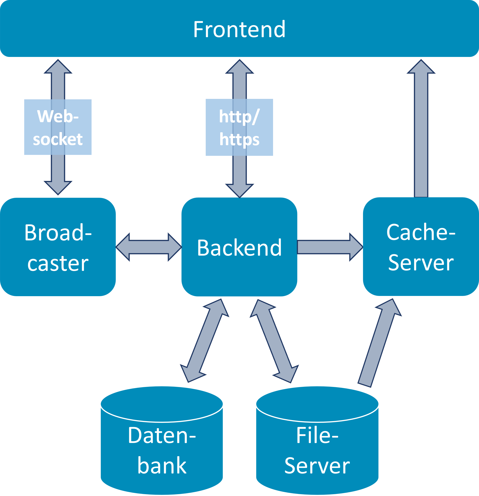

# Überblick

{width="400"}

Die Kubernetes-Konfiguration des IQB Testcenters basiert auf Helm-Charts und ist auf eine Microservice-Architektur sowie eine hohe Skalierbarkeit und Ausfallsicherheit ausgelegt. Die gesamte Konfiguration befindet sich im Projektverzeichnis unter scripts/helm/.

## Architektur und Microservices

Die Anwendung ist in mehrere unabhängige Komponenten (Pods) unterteilt, die jeweils in eigenen Deployments definiert sind:

* Frontend (Angular SPA): Die Weboberfläche der Anwendung. Sie wird als statuslose (stateless) Anwendung bereitgestellt und hat geringe Hardware-Anforderungen. Da sie nur statische Dateien ausliefert, kann sie bei Bedarf horizontal einfach skaliert werden.
* Backend (PHP/Slim REST API): Das Herzstück der Anwendung, welches die gesamte Geschäftslogik, Authentifizierung und Datenbankzugriffe steuert. In der Konfiguration ist broadcasterEnabled und fileServerEnabled vorgesehen, um Zugriffe modular auf diese Dienste umzuleiten.
* Broadcaster (Node.js/NestJS): Ein dedizierter Service, der WebSocket-Verbindungen verwaltet. Da das PHP-Backend zustandslos arbeitet, übernimmt diese Komponente die Verwaltung der Echtzeit-Kommunikation (z. B. für den Monitor-Modus der Testleiter).
* File-Server (Nginx basiert): Ein optimierter Nginx-Webserver, um hochgeladene Testdateien und statische Inhalte auszuliefern. Optional kann hier die Integration mit dem Cache Server (Redis) aktiviert werden, um oft abgerufene Dateien zu cachen.

## Speicherdienste und Stateful-Komponenten

* Datenbank (db - MySQL 8.4): Speichert persistente Anwendungsdaten, Ergebnisse, Metadaten und Nutzerprofile. Die Konfiguration nutzt hier Kubernetes Persistent Volume Claims (PVC), um den Speicher bei Neustarts der Pods nicht zu verlieren.
* Cache-Server (cacheServer - Redis 8.0): Ein In-Memory-Speicher, der für Sessions sowie das Zwischenspeichern von statischen Inhalten (File-Server) genutzt wird, um die Zugriffszeiten drastisch zu reduzieren.

## Infrastruktur- & Systemkomponenten

Das Testcenter liefert auch eigene Kubernetes-Infrastruktur-Dienste mit, die über das Installations-Skript (scripts/helm/helm-install-tc.sh) zugeschaltet werden können:

* Traefik (Ingress-Controller): Wird als standardisiertes API-Gateway genutzt, das die eintreffenden Web-Requests (HTTP/HTTPS) entgegennimmt und an den richtigen Service (z.B. Frontend oder direkte API-Routen für das Backend) weiterleitet. Er kümmert sich auch um die SSL/TLS-Terminierung (tlsEnabled: true).
* Longhorn (Persistent Storage): Ein Storage-Provisioner für Kubernetes. Wenn das Testcenter in einem frischen Cluster aufgesetzt wird, kann das Skript automatisch Longhorn installieren und konfigurieren. Alle zustandsbehafteten Dienste (wie MySQL, Backend-Files) verwenden dann "Longhorn Persistent Volumes", da dieses System Block Storage über das Cluster verteilt und repliziert (storageClass: longhorn).

## Skalierung und Ausfallsicherheit (values.yaml)

Die values.yaml Datei definiert genau, wie sich das System bei Deployment und Betrieb verhalten soll.
Besondere Merkmale der Konfiguration:

* Rolling Updates (strategy.type: RollingUpdate): Updates finden ohne Downtime statt (maxUnavailable: 0 und maxSurge: 1), d.h. neue Pods werden gestartet bevor alte gestoppt werden.
* Ressourcen-Beschränkungen (resources.limits & requests): Jedem Service werden genaue CPU- und Arbeitsspeicher-Garantien zugeteilt, um das Cluster nicht zu überlasten. (z. B. DB: max 2 GB RAM, Backend: max 1 GB RAM).
* Health-Checks (Liveness, Readiness, Startup Probes): Zur Überwachung des Zustands hat das System für jeden Dienst definierte Parameter, wann ein Dienst als "bereit" gilt oder er neu gestartet werden muss.

## Das Installations-Skript (helm-install-tc.sh)

Um die Kubernetes-Konfiguration zu vereinfachen, existiert dieses Skript, welches eine interaktive Installation vornimmt:

* Prüft die Systemvoraussetzungen (kubectl, helm).
* Fragt ab, ob Longhorn für persistente Volumens installiert werden soll.
* Fragt ab, ob Traefik installiert und wie die Basis-Domain lauten soll.
* Generiert automatisch sichere, zufällige Standard-Passwörter (z.B. für Datenbank-Root, den iqb_tba_db_user, Redis etc.) und schreibt diese überschreibend (als Secret) in das Helm-Release.
* Deployt abschließend die Anwendung (normalerweise in den tc Namespace).

# Server-Administrator\*in: Konfigurationsoptionen in der .env.prod

Betreiber einer Testcenter-Instanz (Server-Admins) können im .env-File eine Reihe von Konfigurationen Vornehmen. Eine vollständige Liste
aller aktuell vorhandenen Konfigurationsparameter befinden sich
[hier](https://github.com/iqb-berlin/testcenter/blob/master/docker/default.env).
Diese sollten nur mit Vorsicht und Kenntnis verändert werden.

## Version

```{.ini}
VERSION=15.1.8
```
Die verwendete Testcenter-Version. Wird hier eine höhere (verfügbare) Version eingetragen, so werden beim nächsten Start
entsprechen images von DockerHub gezogen und in der Folge die Datenbank angepasst. Dies sollte allerdings **niemals** von Hand
erfolgen, sondern mittels der `update.sh`, da diese auch die compose-files usw. aktualisiert.
Downgrades auf eine vergangene Version sollten grundsätzlich vermieden werden.

## Grundsätzliche Netzwerkeinstellungen.

```{.ini}
HOSTNAME=localhost
```
Servername, z. B. `ìqb-testcenter4.de`. Wenn Sie eine www-subdomain als Alternativen Namen verwenden wollen, geben Sie
das `www` *nicht* mit an - es wird eine automatische Weiterleitung eingerichtet.

```{.ini}
TLS_ENABLED=no
```
Soll TLS (https) verwendet werden? Wenn ja, sollten sie entsprechende Zertifikate hinterlegen (siehe [hier](#server-admin-tls-einrichten)).
Der default ist hier `yes`.

```{.ini}
PORT=80
TLS_PORT=443
```
Der Port auf dem das Testcenter laufen soll. Ist `TLS_ENABLED` gesetzt wird der `TLS_PORT` genutzt, ansonsten wird der `PORT` genutzt.

## Sicherheit

```{.ini}
PASSWORD_SALT=t
```
Salt für verwendete admin-passwörter.
Achtung: Ändern Sie diese Einstellung nicht mehr, nachdem Sie die Applikation bereits einmal gestartet haben, sonst können Sie sicht nicht mehr einloggen.

## Services

### Datenbank Connection

```{.ini}
MYSQL_ROOT_PASSWORD=secret_root_pw
MYSQL_DATABASE=iqb_tba_testcenter
MYSQL_USER=iqb_tba_db_user
MYSQL_PASSWORD=iqb_tba_db_password
```
Verbindungen zur Datenbank. Wird normalerweise bei der Installation gesetzt und nicht mehr angefasst.

### Broadcasting Service

```{.ini}
BROADCAST_SERVICE_ENABLED=true
```
Der Broadcasting-Service ist ein **optionaler** Zusatzservice, der Websocket-Verbindungen ermöglicht. Sollten ihre
Server oder Teilnehmer aus irgendwelchen Gründen Websockets nicht verwenden wollen oder können, können Sie ihn hier
abschalten.

### File Service

```{.ini}
FILE_SERVICE_ENABLED=true
```
Der File-Service übernimmt die Auslieferung der eigentlichen Testinhalte. Ihn abzuschalten und die Inhalte mit dem
Backend ausliefern verschlechtert die Performance des Testcenters maßgeblich.

### Cache Service

```{.ini}
CACHE_SERVICE_INCLUDE_FILES=no
CACHE_SERVICE_RAM=1073741824
```
Der Cache-Service cached Authentifizierungen für den File-Service, sodass beim Laden der Testinhalte das Backend nicht
mehr verwendet werden muss.

Er kann aber auch verwendet werden, um die Testinhalte selbst im Arbeitsspeicher des Servers zu speichern. Dazu ist dieser
parameter auf `yes` zu setzen und eine entsprechende Menge dafür freigegebenen Arbeitsspeicher (in Byte) anzugeben.
Es liegen bisher wenig Erkenntnisse über Performance-Gewinn, Fehleranfälligkeit usw. dieser Option vor, daher ist sie
Standardmäßig ausgeschaltet.

## Weitere Netzwerkeinstellungen

```{.ini}
DOCKER_DAEMON_MTU=1500
```
MTU wert des Netzwerks. Außer in bestimmten Server-Umgebungen ist er 1500.

```{.ini}
DOCKERHUB_PROXY=''
```
Sie verwenden einen lokalen Proxy für DockerHub? Dann können Sie ihn hier angeben.

```{.ini}
RESTART_POLICY=no
```
Restart-Policy der Docker-Container: no, always, on-failure, unless-stopped

## Development Parameters

Die folgenden Parameter können für Experimente, in Debug-Situationen usw. eingesetzt werden. Sie sollten im
Normalbetrieb aber nie im .env File auftauchen:

```{.ini}
OVERWRITE_INSTALLATION="no"
```
Bei Neustart wird die Installation neu aufgesetzt. *Alle Daten, User, Testinhalte und Konfigurationen gehen mit Neustart verloren*.

```{.ini}
SKIP_READ_FILES="no"
```
Das (Neu-)Einlesen der Dateien beim Start wird übersprungen. Damit kann der Systemstart deutlich beschleunigt werden,
die Datenintegrität ist jedoch nicht mehr gewahrt. **Ab Testcenter 15.2.0 werden ohnehin nur noch Workspaces neu
eingelesen, die sich verändert haben. Die Einstellung ist damit beinahe obsolet.**

```{.ini}
SKIP_DB_INTEGRITY="no"
```
Der Integritätscheck der Datenbank beim Starten wird übersprungen. Nur dann nützlich, wenn man ein kaputtes System
unbedingt noch einmal hochfahren will.

```{.ini}
NO_SAMPLE_DATA="no"
```
Das Anlegen des Beispiel-Arbeitsbereiches wird bei einer Neuinstallation übersprungen. Wird ein bereits vorhandenes
System gestartet, hat diese Einstellung keine Auswirkungen.

# Server-Administrator\*in: TLS einrichten

Außer in [Offline-Szenarien](/setup/offline/index.qmd) muss TLS verwendet
werden. Dazu sind Zertifikate zu besorgen und im testcenter-Verzeichnis unter `config/certs` abzulegen. Die Namen der
Zertifikatsdateien sind in der Datei `config/tls-config.yml` anzugeben.

Ist TLS nicht eingerichtet, so wird ein self-signed-Certificate verwendet - mit der Folge, dass Nutzer des Testcenters
eine Sicherheitswarnung von ihrem Browser bekommen.

# Super-Administrator\*in: Systemeinstellungen in der UI

Super-Administrator\*innen haben Zugriff auf die Systemeinstellungen. Die Anmeldung am Testcenter erfolgt über den Schalter **Weiter als Admin**. Zur Liste der Arbeitsbereiche erscheint anschließend ein Schalter **Systemverwaltung**. Nach einem Klick auf diesen Schalter, stehen die folgenden Einstellungen über entsprechende Reiter zur Verfügung:

## User

Hier können bestehende Nutzer\*innen (Arbeitsbereichs-Admins) verwaltet werden. Die -Schaltfläche erzeugt neue Arbeitsbereichs-Admins. Mit der -Schaltfläche kann ein Bereich gelöscht werden. Weiterhin stehen zwei Schaltflächen zur Änderung von Kennwort und Zugriffsebene bereit. Diese beide Schaltflächen sind mit einem -Symbol gekennzeichnet. Ist eine Person als Super-Admin angelegt, wird diese mit einem Stern in der Liste der Nutzer\*innen geführt. Wird in der Liste eine Person markiert, werden auf der rechten Seite alle Arbeitsbereiche angezeigt auf die diese Person Zugriff hat. Die Berechtigung für einen Arbeitsbereich sind noch einmal unterteilt in "read only" (RO) und "read and write" (RW).

## Arbeitsbereiche

Hier werden alle angelegten Bereiche aufgelistet. Es können neue Bereiche angelegt, gelöscht oder nachträglich bearbeitet werden. Durch Markierung eines Bereichs werden rechts alle Personen aufgelistet, die auf diesen Bereich Zugriff haben. Dabei wird noch einmal unterschieden, ob eine Personen nur lesend (RO) oder lesend und schreibend (RW) auf den Bereich zugreifen darf. Sollen Personen einen Zugriff auf einen Bereich erhalten, ist der jeweilige Bereich zu markieren und die Person mit RO- oder RW-Zugriff auszuwählen. Anschließend muss zwingend die -Schaltfläche oben rechts aktiviert werden, ansonsten werden die Änderungen nicht gespeichert.

## Einstellungen

Hier können einige Bereiche des Testcenters an individuelle Bedürfnisse angepasst werden. Es ist bspw. möglich das Logo auszutauschen, die Hintergrundfarbe und Texte der Anwendung zu verändern. Es können auch Textersetzungen für die Bereiche: Testheft, Gruppenmonitor, Login und System-Check erfolgen. Sollen Texte ersetzt werden, ist nach Änderungen zwingend die -Schaltfläche zu betätigen, um die Änderungen zu übernehmen. Außerdem kann zu Wartungszwecken eine entsprechende Warnmeldung auf der Anmeldeseite geschaltet werden.

### Das Aussehen der Anwendung grundsätzlich anpassen

Hintergrundfarbe, Name, Logo u. Ä. der Anwendung lässt sich verändern. Bei den Farben sind sämtliche
[CSS-Farben](https://www.w3schools.com/cssref/css_colors.php) und sogar CSS-Farbverläufe usw. möglich.

### Die Fehlerreport-Funktion konfigurieren

Wenn immer im Testcenter eine Fehlermeldung auftaucht, gibt es die Möglichkeit, einen ausführlichen Report anzuzeigen,
und herunterzuladen. Wird dieser an die Entwickler gesendet, haben diese eine Chance das Problem zu beheben. Eine
Testcenter-Instanz kann so konfiguriert werden, dass Fehlerreports auch auf Knopfdruck direkt eingesendet werden können.
Betreiber eines Testcenters können auf diese Weise auftretende Fehler geordnet tracken.

Als Bugtracker kann derzeit nur GitHub angeschlossen werden. Dazu kann der Super-Admin entsprechend ein Token und ein
Repository angeben. Das Testcenter selbst wird bewusst nicht als BugTracker verwendet, sondern ein externer Service,
damit Fehlerberichte auch bei nicht erreichbarem Testcenter-Server gesendet werden können.

#### GitHub als BugTracker konfigurieren

* ein GitHub Projekt mit aktivierten `issues` auf GitHub.com wird benötigt
* es ist im Feld Ziel-Repository das Repository in der üblichen Schreibweise `{Organisatiosname}/{Repositoryname}`
 anzugeben, z.B. `iqb-berlin/bugreports`
* [Auf GitHub muss ein Token erzeugt werden](https://github.com/settings/tokens?type=beta) das auf dieses Repository 
  Zugriff hat und folgendes Recht hat: `Read and Write access to issues`. Dieses ist bei `GitHub-Token` einzutragen.