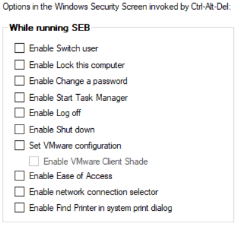
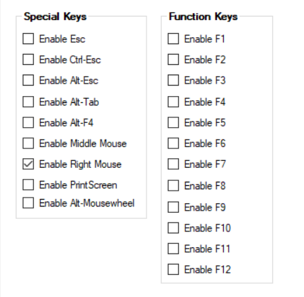
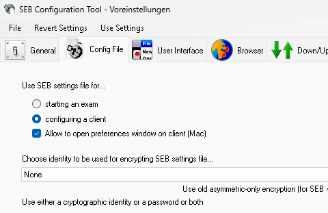
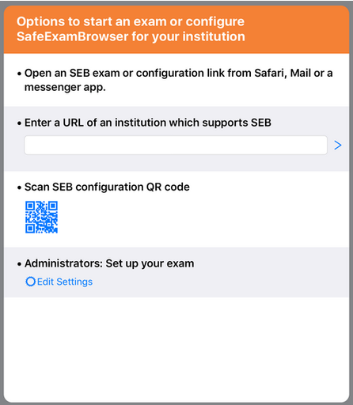
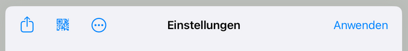

Der [SEB](https://safeexambrowser.org/about_overview_de.html) ist ein externes Tool. Es muss auf jedem Gerät installiert werden. Danach muss eine Konfiguration für den SEB geladen oder erstellt werden. In dieser wird festgelegt, wie sich der SEB zu verhalten hat.

::: {.callout-note}
Der SEB kann nur unter IOS und Windows verwendet werde. Eine ausführliche Dokumentation ist auf der offiziellen SEB-Website verfügbar.
:::

# Windows

## Konfiguration

::: {.callout-note}
Eine auf Windows erzeugte Konfiguration ist nicht kompatibel zu IOS-Geräten. Hier muss auf dem iOS-Gerät eine eigene Konfiguration erzeugt werden. Mehr dazu ist dem Abschnitt "iPad iOS" zu entnehmen.
:::

Das IQB kann eine Vorlage für die Konfiguration bereitstellen. Diese würde unter anderem folgende Einstellungen beinhalten:  

* Start URL: Die Adresse des Testcenters
* Browser View Mode: Fullscreen Mode 
* Disable browser window toolbar(Windows)/menü bar (MacOS) (keine Navigationselemente im Browser)
* Disable taskbar(Windows)/dock(MacOS)
* Disable wifi-control(Windows)
* Disable keyboard layout (man kann nicht auf andere Tastaturen wechseln)
* Enable reload button (expliziter Button zum Neuladen der Seite)
* Disable copy/paste

{#fig-task}

Außerdem können weitere Tastenkombinationen wie Alt + F4 oder Alt + Tab ebenfalls deaktiviert werden.

{#fig-keys}

### Bestehende Konfiguration öffnen

1. `C:\Program Files\SafeExamBrowser\Configuration` -> `SEBConfigTool.exe` starten
2. File -> `open settings`
3. Passworteingabe: Eingerichtetes Passwort für die Konfiguration (falls in der Konfiguration festgelegt)

### Neue Konfiguration erstellen

`C:\Program Files\SafeExamBrowser\Configuration` -> `SEBConfigTool.exe` starten

### Konfiguration speichern

::: {.callout-note}
Bevor die finale Konfiguration gespeichert wird, sollte entschieden sein, wie die Konfiguration später mit dem SEB verbunden werden soll. Soll die Konfiguration nur für eine aktive Sitzung verwendet werden oder soll die Konfiguration dauerhaft mit dem SEB verbunden werden?
:::

Die Festlegung, ob die Konfiguration dauerhaft oder nur temporär mit dem SEB verbunden werden soll, wird in der Konfiguration unter dem Tab "Config-File" vorgenommen.

{#fig-task}

#### Temporäre Konfiguration

Dazu ist der Punkt "Starting an exam" zu aktivieren. Die Speicherung erfolgt über `File` -> `Save` oder `Save as`. Die Konfiguration kann anschließend an die Testleitung versendet werden. Die Testleitung muss diese dann auf die Geräte verteilen, die für die Testung vorgesehenen sind.

#### Dauerhafte Konfiguration

Dazu ist der Punkt "Configuring a client" zu aktivieren. Die Speicherung erfolgt über `File` -> `Save` oder `Save as`. Die Konfiguration kann anschließend an die Testleitung versendet werden. Die Testleitung muss diese dann auf die Geräte verteilen, die für die Testung vorgesehenen sind.

### Konfiguration anwenden

Die gespeicherte Konfiguration wird durch einen Doppelklick mit der installierten SEB-Version verbunden.

## SEB starten

Bei Anwendung einer dauerhaften Konfiguration (Öffnen der Konfigurationsdatei), wird der SEB im Anschluss ausgeführt. Soll der SEB ein weiteres Mal geöffnet werden, kann dies klassisch über das Startmenü erfolgen. 

Bei Anwendung einer temporären Konfiguration (Öffnen der Konfigurationsdatei), wird der SEB im Anschluss ebenfalls ausgeführt. Wir der SEB dann klassisch via Startmenü ein weiteres Mal geöffnet, wird die Konfiguration nicht angewendet. In diesem Fall muss die Konfiguration erneut über die Konfigurationsdatei geöffnet werden.

## SEB beenden

Wenn in der Konfiguration festgelegt wurde, dass das Beenden des SEB möglich sein soll, kann über eine entsprechende Schaltfläche unten rechts die aktive SEB-Sitzung beendet werden. Eventuell ist zum Beenden ein Passwort eingerichtet. Dieses muss dann zur Bestätigung eingegeben werden. Falls das Beenden des SEB in der Konfiguration nicht vorgesehen ist,  kann der SEB durch die Tastenkombination `Ctrl + Alt + Delete` und einer Abmeldung des aktiven Windows Benutzers beendet werden. Zu beachten: Windows Einstellungen, die über `Ctrl + Alt + Delete` erreichbar sind, können über die Konfiguration eingeschränkt bzw. deaktiviert sein. Ist dies der Fall, hilft nur das Ausschalten des Gerätes, um den SEB zu beenden. Bei den meisten Geräte muss hierfür für mehrere Sekunden die Ein/Aus-Taste gedrückt werden.

# iPad iOS

## Konfiguration

::: {.callout-note}
Eine auf IOS erzeugte Konfiguration ist nicht kompatibel zu Windows-Geräten. Hier muss auf dem Windows-Gerät eine eigene Konfiguration erzeugt werden. Mehr dazu ist dem Abschnitt "Windows" zu entnehmen.
:::

### Bestehende Konfiguration öffnen

**Voraussetzungen:** Eine Konfiguration muss bereits mit dem SEB verbunden sein. Sprich, eine Konfiguration wurde bereits einmal auf dem iPad geöffnet. 

Bearbeitung einer bestehenden Konfiguration erlauben:

1. iPad Einstellungen öffnen
2. links zu "Apps" scrollen 
3. SEB in der Liste suchen und anklicken
4. im Menü "Bearbeiten erlauben" auswählen.

SEB öffnen und das ggf.eingerichtete Passwort für die Konfiguration eingeben. Im Anschluss sind alle Konfigurationsmöglichkeiten zu sehen und wie diese in der aktuellen Konfiguration gesetzt sind.

### Neue Konfiguration erstellen

Wird der SEB erstmalig nach der Installation gestartet, erscheint folgendes Menü:

{#fig-task}

Hier kann über den Menüpunkt "Administrators: Setup your exam" -> "Edit Settings" die Konfiguration gestartet werden.

### Konfiguration speichern

Bei der Speicherung wird festgelegt, ob die so erzeugte Konfiguration dauerhaft auf dem verwendeten Gerät mit dem SEB verbunden wird oder ob die Konfiguration nur für die aktive Sitzung verwendet wird. Hierfür stehen entsprechende Menüpunkte in der Konfigurationsoberfläche zur Verfügung:

{#fig-task}

#### Temporäre Konfiguration

Um eine temporäre Konfiguration zu speichern, muss in Abbildung 5 auf das Symbol: QR-Code geklickt werden. Dieser QR-Code kann dann an die Testleitung verschickt werden. 

#### Dauerhafte Konfiguration

Um die Konfiguration dauerhaft zu speichern, wird das Symbol mit dem Pfeil verwendet. Die so gespeicherte Datei kann dann an die Testleitung versendet werden. Diese verteilt die Konfigurationsdatei auf die entsprechenden Geräte. 

### Konfiguration anwenden

**Temporär Konfiguration:** 
Wenn ein "frischer" SEB (noch nie geöffneter oder ohne dauerhafte Konfiguration betriebener SEB) auf einem iPad für die Testdurchführung geöffnet wird, wird das Startmenü (Abbildung 4) angezeigt. Hier kann der Punkt "Scan SEB Configuration QR Code" gewählt werden. Es erscheint ein Auswahlfenster, in dem die Kamera des iPads aktiviert wird. Mit dieser kann der zuvor erzeugte QR-Code eingelesen werden. 

**Dauerhafte Konfiguration:** 
Doppelklick auf die Konfigurationsdatei (.seb), die zuvor auf das Gerät geladen wurde. Die Konfiguration verbindet sich nun dauerhaft mit dem SEB.

## SEB starten

Bei Anwendung einer dauerhaften Konfiguration (Öffnen der Konfigurationsdatei), wird der SEB im Anschluss ausgeführt. Soll der SEB ein weiteres Mal geöffnet werden, kann dies klassisch über den iPad Homescreen erfolgen. Es wird dann nicht erneut nach einer Konfiguration gefragt.

Bei Anwendung einer temporären Konfiguration (Öffnen via Startmenü QR-Coded), startet der SEB direkt nach dem Einscannen des QR-Codes für die temporäre Konfiguration.

## SEB beenden

Von links nach rechts wischen. Es erscheint eine Leiste mit der Möglichkeit die Session zu beenden. Dazu muss ggf. das in der Konfiguration hinterlegte Passwort verwendet werden. 

Falls das Beenden in der Konfiguration nicht erlaubt wurde, muss das iPad neu gestartet werden. Dazu Hometaste und Aus-/Einschalter dauerhaft für mind. 5 Sekunden gedrückt halten.