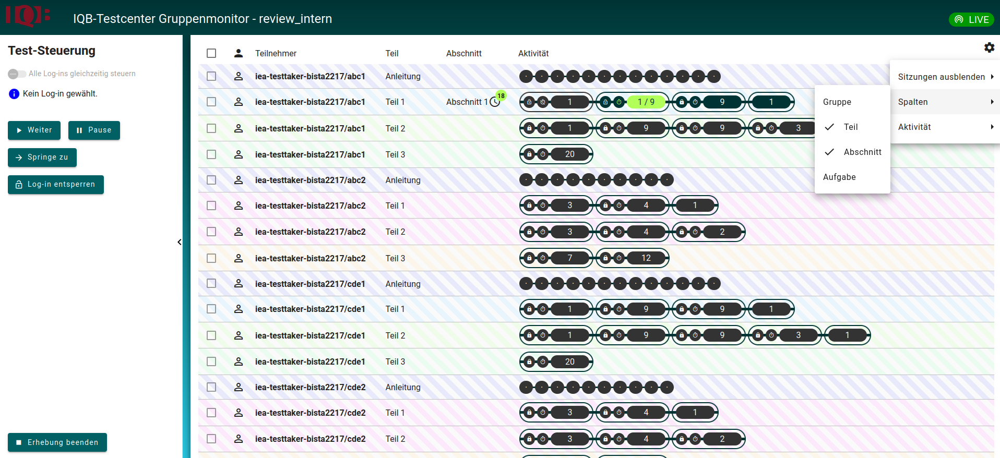
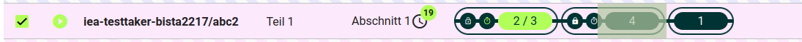
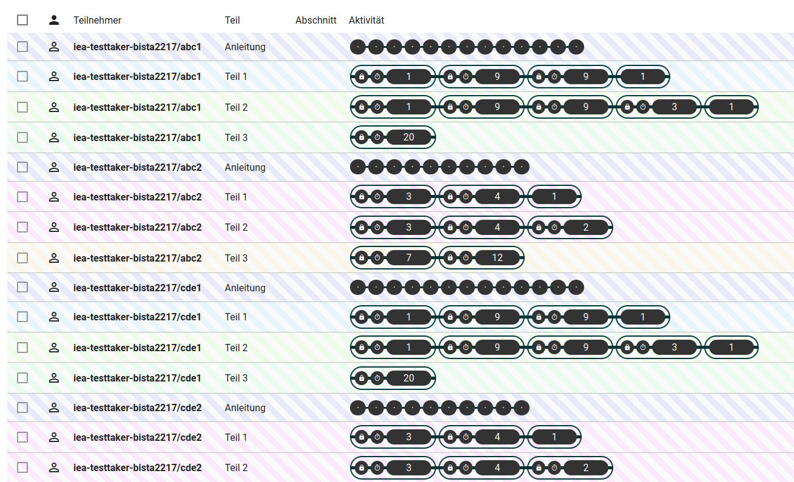
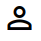
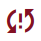

::: {.callout-note}
Der Gruppenmonitor wird auch manchmal als **Testleitungskonsole** bezeichnet.
:::

Die Zugangsdaten der Testpersonen sind Gruppen zugeordnet. Der Testleitung steht ein spezielles Instrument zur Verfügung, eine Gruppe während der Testdurchführung zu beobachten und die Teilnehmer ggf. im Test zu navigieren. Dieses Instrument trägt die Bezeichnung: **Gruppenmonitor**. Der Gruppenmonitor ist ein Teil des Testcenters, es handelt sich hier also nicht um eine separate Anwendung.

Um den Gruppenmonitor nutzen zu können, muss dieser für die gewünschte Personengruppe angelegt werden. Zugangsdaten und die Zuweisung von Personen zu Gruppen werden in der Testtaker-XML eingerichtet. Der Gruppenmonitor wird mit Hilfe eines speziellen Zugangs mit dem Modus: `monitor-group` in der zu steuernden Gruppe angelegt.

```{.xml}
<Testtakers>

  <Metadata>
    <Description>Beispielhafte Testtaker-XML</Description>
  </Metadata>

  <CustomTexts></CustomTexts>

  <Group id="sample_group" label="Primary Sample Group">
    <Login mode="run-hot-return" name="Testperson1" pw="jk87zt">
      <Booklet>BOOKLET.SAMPLE-1</Booklet>
    </Login>
     <Login mode="run-hot-return" name="Testperson2" pw="ghbv5">
      <Booklet>BOOKLET.SAMPLE-1</Booklet>
    </Login>
     <Login mode="run-hot-return" name="Testperson3" pw="hg54d">
      <Booklet>BOOKLET.SAMPLE-1</Booklet>
    </Login>
    <Login mode="monitor-group" name="test-group-monitor" pw="er45tz"/>
  </Group>
</Testtakers>

```

# Anmeldung

Um den Gruppenmonitor zu starten, meldet sich die Testleitung mit entsprechenden Zugangsdaten (hier im Beispiel: **test-group-monitor** und **er45tz**) am Testcenter an. Anschließend öffnet sich der Gruppenmonitor und zeigt eine Liste aller verfügbaren Testhefte und eine Schaltfläche um den Gruppenmonitor zu starten. Die entsprechende Schaltfläche ist zu finden unter der Bezeichnung: **Test-Gruppen Überwachung**.

# Bedienung und Ansicht

::: {.callout-note}
Der Gruppenmonitor bietet verschiedene Ansichtsoptionen. Alle nachfolgenden Bilder werden mit den folgenden Ansichtsoptionen dargestellt: **Spalten:** Teil und Abschnitt **Aktivität:** Nur Abschnitte. Wird diese Anleitung parallel zu einem geöffneten Gruppenmonitor verwendet, sind zuvor die Ansichtsoptionen entsprechend zu setzen.
:::

Beispielhafte Ansicht eines Gruppenmonitors:



## Testnavigation (links)

Hier sind Schalter für die Navigation zu finden. Diese haben erst eine Funktion, wenn im rechten Teil (Aktivitätsfenster) eine entsprechende Testperson angewählt wurde. Die Testperson muss online sein, also den Test gerade bearbeiten. Es ist möglich die Testperson zu einem anderen Block im Testheft zu navigieren (springen), den Test zu pausieren, den Test zu sperren oder den Test zu beenden. Ganz oben ist ein Schalter mit der Bezeichnung: **Alle Logins gleichzeitig steuern** zu sehen. Diese Funktion steht nur zur Verfügung, wenn alle in der Gruppe verwendeten Testhefte eine ähnliche Struktur aufweisen. Sind bspw. in den Testheften unterschiedlich viele Blöcke enthalten, ist eine gemeinsame Steuerung nicht möglich. Da in diesem Beispiel unterschiedliche Testhefte verwendet werden, ist der Schalter im Bild auch inaktiv.

#### Pausieren

Markieren Sie im Aktivitätsfenster die gewünschte Person und betätigen Sie anschließend die Schaltfläche: **Pause**. Ist der Test erfolgreich pausiert, erscheint das entsprechende -Symbol bei der Person. Außerdem erscheint im Browser der Person eine entsprechende Meldung, dass der Test pausiert wurde. Soll das Pausieren aufgehoben werden, ist erneut die entsprechende Person zu markieren und anschließend ist die Schaltfläche: **Weiter** zu betätigen. Der Test wird dann fortgeführt.

#### Weiter

Der Test kann mithilfe dieses Schalters nach Pausierung fortgesetzt werden.

#### Springe zu Block

Besteht ein Testheft aus mehreren Blöcken (Abschnitten), kann mittels Gruppenmonitor eine Testperson zu einem bestimmten Block navigiert werden. Hierfür muss zuvor der Block, zu dem gesprungen werden soll, selektiert werden. Wie die Selektierung eines Blocks erfolgt, hängt davon ab, ob alle Personen gleichzeitig gesteuert werden oder nicht.

**Schalter: "Alle Tests gleichzeitig steuern" ein:**

Durch einen Maus-Linksklick auf einen Block innerhalb einer Personenzeile, werden automatisch alle Blöcke in derselben Spalte selektiert und die zugehörigen Personen werden aktiviert (Haken vor Person wird gesetzt). Ein Klick auf "Springe zu ..." bewirkt dann einen Wechsel aller Personen in den gewählten Block. Durch einen Maus-Rechtsklick auf einen der selektierten Blöcke, wird die Selektierung aller Blöcke wieder aufgehoben.

**Schalter: "Alle Tests gleichzeitig steuern" aus:**

Um Blöcke für einzelne Personen zu selektieren, ist es nicht notwendig, den Haken vor einer Personen zu wählen. Es reicht mit einem Maus-Linksklick, auf den zu selektierenden Block zu klicken. Dies bewirkt sowohl eine Selektierung des Blocks als auch der Personen der jeweiligen Zeile. Bei einem weiteren Maus-Linksklick werden automatisch alle Blöcke in der selben Spalte selektiert und die zugehörigen Personen werden aktiviert (Haken vor Person wird gesetzt). Durch einen Maus-Rechtsklick auf einen der selektierten Blöcke wird die Selektierung wieder aufgehoben.

Nachfolgend wird der zweite Block der Anmeldung: **abc2** des Testhefts: **Teil1** markiert.



Wie zu sehen ist, wird bei erfolgreicher Markierung der Block entsprechend gekennzeichnet. Nun wird der Schalter: **Springe zu** betätigt. Die gewählte Person wird nun in den zweiten Block navigiert.

::: {.callout-important}
Navigiert die Testleitung eine Person aus einem zeitbeschränkten Block, wird dieser Block gesperrt und die Person kann nicht mehr darauf zugreifen, auch wenn die Bearbeitung noch nicht abgeschlossen war. Durch ein erneutes "Springe zu" in einen bereits gesperrten Block, kann der Block im Gruppenmonitor wieder entsperrt werden (ab Version 15.4.0). Wurde der Block entsperrt, beginnt die festgelegte Zeit wieder von vorne. Die Testleitung muss dann individuell entscheiden, ob die Testperson noch einmal die volle Zeit im Block verbringen darf oder ob die Testperson vor Ablauf der Zeit den Block wieder verlassen muss. Das Entsperren von Blöcken birgt durch den Neustart der Zeit das Risiko einer Testverfälschung und sollte mit Bedacht verwendet werden. Gibt es bspw. technische Probleme, die verhindern, dass eine Testperson einen Block vollständig bearbeiten kann, ist das Verlassen und Wiederbetreten des Blocks durchaus legitim.
:::

::: {.callout-note}
Wird in einen Block gesprungen, der über ein Zugangskennwort verfügt, entfällt die Kennwortabfrage bei der Testperson. Das Kennwort wird nur abgefragt, wenn eine Testperson eigenständig in einen beschränkten Block navigiert. Auf diese Weise können Testpersonen besser zusammengehalten werden und alle befinden sich in etwa an der gleichen Stelle im Testverlauf.
:::

#### Test beenden

Wird der Schalter: **Test beenden** betätigt, wird das Testheft für alle Personen beendet und gesperrt. Außerdem wird der Gruppenmonitor verlassen. Es müssen zuvor keine Personen in der Liste markiert werden, damit der Schalter Funktion hat.

#### Testheft entsperren

Ein Testheft kann mit Hilfe des Schalters: **Test entsperren** wieder entsperrt werden. Dazu wird die jeweilige Person selektiert und der Schalter: **Test entsperren** betätigt. Ein Testheft kann aus folgenden Gründen gesperrt sein:

* Es wurde der Schalter: **Test beenden** betätigt. Das bewirkt eine Sperrung aller Testhefte und ein Verlassen des Gruppenmonitors. Nach erneuter Anmeldung am Gruppenmonitor können die Testhefte aber wieder entsperrt werden.
* In der Testheftkonfiguration gibt es den Parameter: `lock_test_on_termination`. Dieser erhält standardmäßig den Wert **OFF**. Ist der Wert **ON** wird der Test nach Beendigung durch die Testperson gesperrt.

::: {.callout-note}
Für die Entsperrung eines Blocks kann dieser Schalter nicht verwendet werden.
:::
## Systeminformationen, Einstellungen und Status (rechts)

### Verbindungsstatus

Oben rechts ist das Symbol für den Verbindungsstatus des Gruppenmonitors zu sehen {width=80px}. Der Status kann abhängig von der Verbindungsqualität wechseln:

* OFFLINE: Es besteht eine Störung der Verbindung. Keine Verbindung mehr zur Testsession. 
* RECONN: Es wird versucht, eine Verbindung herzustellen. In dieser Phase besteht keine Verbindung zur Testsession.
* LIVE: Fehlerfreie Verbindung im WebSocket-Betrieb.
* POLLING: Es besteht eine Verbindung via Polling-Betrieb. Die Verbindung via WebSocket ist gestört und kann nicht aufgebaut werden. Es greift ein Fallback auf den Polling-Betrieb. In diesem Fall ist die Verbindung zum Gruppenmonitor nicht so stabil wie im Live-Modus, aber es besteht zumindest eine Verbindung.

::: {.callout-note collapse="true"}
## Technische Informationen Polling/WebSocket
WebSocket:<br>
Persistente bidirektionale Verbindung. Die Verbindung zwischen Gruppenmonitor und der jeweiligen Testsession erfolgt über die Technologie WebSocket. Es wird nur einmalig eine Verbindung zum Server aufgebaut, diese bleibt während der gesamten Testsession bestehen und wird nicht für jede Aktualisierung neu aufgebaut. Dies entlastet die Server-/ Client-Kommunikation und spart unnötige Handshakes. 

Polling:<br>
Periodischer Verbindungsaufbau. Beim Polling öffnet der Client jedes Mal eine neue HTTP-Verbindung — mit vollständigem Header-Overhead, TCP-Handshake und Wartezeit. Der Server wird regelmäßig belastet, auch wenn sich gar nichts geändert hat.
:::

### Einstellungen

Ebenfalls oben rechts ist eine -Schaltfläche zu sehen. Mit Hilfe dieser kann die Ansicht für das Statusfenster angepasst werden. Hier können bspw. Spalten hinzugefügt werden und Anzeigefilter gesetzt werden. Mehr zum Thema Filter ist [hier](filter.qmd) zu finden.

### Status



###  (Personenstatus):

Der Status einer Testperson kann verschiedene Zustände annehmen. Diese werden mit Hilfe von Symbolen dargestellt. Folgenden Status kann eine Testperson annehmen:

| Symbolik | Beschreibung |
|:-:|-------------------------|
| | Test noch nicht gestartet. | 
| |Test läuft, Verbindung ist live.|
| |Test läuft. Testläufe und Teilnehmer sind im Polling-Modus verbunden. Dies ist ein Fallback für den Fall, dass der Live-Modus aufgrund des Browsers des Betreuers oder eines technischen Fehlers nicht möglich ist. Die Leistung des Monitors ist hierbei nicht so gleichmäßig.|
| |Der Test scheint zu laufen, aber der Verbindungstyp ist unbekannt. Dies ist mehr oder weniger ein Fallback-Zustand, der anzeigt, dass außer seiner Existenz nichts über den Test bekannt ist. Dies kann bei verschiedenen Fehlerszenarien oder Fehlkonfigurationen der Fall sein, sollte aber im Allgemeinen nicht vorkommen. Es sollte untersucht werden, aber höchstwahrscheinlich kann der Test sicher fortgesetzt werden, da der Fehler eher auf der Seite des Monitors liegt.|
| |Test ist 5 Minuten oder länger inaktiv.|
| |Test ist pausiert.|
| |Test ist gesperrt.|
| |Fokus nicht mehr auf Browserfenster. Testperson ist bspw. auf einem anderen Browser-Tab.|
| |Browserfenster wurde geschlossen oder Netzwerkverbindung ist gestört.|
| |Testausführung wurde beendet und kann wieder aufgenommen werden.|

::: {.callout-note}
[Hier](https://pages.cms.hu-berlin.de/iqb/testcenter/pages/test-session-super-states.html) ist auch eine automatisch generierte Liste zu finden.
:::

### Teilnehmer

Es ist im Beispielbild eine längere Kennung zu sehen, die sich wie folgt zusammensetzt:

* Benutzername der Anmeldung, in diesem Fall: **iea-testtaker-bista2217**
* der zur Anmeldung eingegebene Code, in diesem Fall: **abc1**, **abc2** usw..

### Teil

Hier sind die Testhefte zu sehen, die einem Zugangscode zugeordnet sind. Bspw. sind dem Code: *abc1* drei Testhefte zugeordnet: *Anleitung*, *Teil1*, *Teil2* und *Teil3*.

### Abschnitt

Ist der Test gestartet, wird hier der Abschnitt innerhalb eines Blocks angezeigt.

### Aktivität

Es wird der Bearbeitungsstand des Testheftes angezeigt. Es ist zu sehen, an welcher Stelle im Testheft sich die Testperson befindet. Der Zustand eines beschränkten Blocks wird angezeigt. Dazu zählt bspw. die Anzeige der verbleibenden Blockzeit  oder die Anzeige eines Schlosssymbols , wenn der Block gesperrt ist. 

::: {.callout-note}
Je nach Filtereinstellungen können weitere Spalten angezeigt werden. Auf diese wird an dieser Stelle nicht weiter eingegangen, da sie weitgehend selbsterklärend sein sollten.
:::

# Troubleshooting

#### Testperson kann die Aufgabe nicht bearbeiten

**Fehler:** 
Die Testperson kann eine Aufgabe nicht bearbeiten, weil die Inhalte der Aufgabe nicht dargestellt werden. Da die Navigation im Testheft zu anderen Aufgaben eventuell nur möglich ist nachdem eine Aufgabe vollständig beantwortet wurde, kann die Testperson nicht mit der Testung fortfahren.

**Ursache:**
Die Aufgabeninhalte (Video, Grafik etc.) können eventuell nicht vollständig geladen werden.

**Abhilfe:**
Navigieren Sie die Person wieder zum Anfang des Blocks, in dem sich die Aufgabe befindet. Sie können im Gruppenmonitor den Block markieren, in dem sich die Person aktiv befindet. Anschließend bestätigen Sie mit Schalter: **Springe zu**. Auf diese Weise wird der Block nicht verlassen, sondern die Person wird wieder an den Anfang des Blocks geleitet. Dies ist im Falle eines zeitbeschränkten Blocks zu empfehlen, da beim Verlassen eines solchen Blocks der Block gesperrt werden würde.


