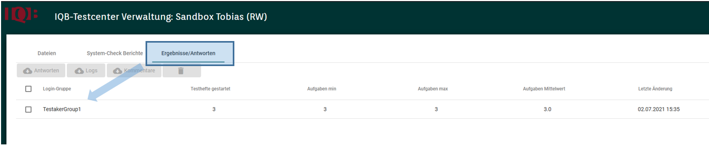

Auf die eigentliche Auswertung wird im gleichnamigen Kapitel gesondert eingegangen. An dieser Stelle wird nur beschrieben, wie Studiendaten aus dem Testcenter geladen werden und für die Auswertung genutzt werden können.

# GUI Download der Studiendaten

Um die Daten aus einer Studie zu erhalten, steht im betreffenden Arbeitsbereich der "Ergebnisse/Antworten" zur Verfügung. Hier können die Daten der Testgruppe(n) ausgewählt und heruntergeladen werden. Die Daten werden in einer CSV-Datei bereitgestellt. Diese Datei kann in gängigen Tabellenkalkulationsprogrammen geöffnet werden.

Nach Auswahl der gewünschten Testgruppe(n) kann ausgewählt werden, ob Logs oder die Antworten heruntergeladen werden sollen.

# API Download der Studiendaten

Es ist möglich die Daten auch über das API abzuholen. [Hier](https://iqb.pages.cms.hu-berlin.de/testcenter/dist/api/index.html#tag/admin-workspace) sind die Befehle zum Abrufen der Daten zu finden.

::: {.callout-tip}
Bei großen Datenmengen kann ein manueller Download recht mühsam sein. Besser ist dann die Nutzung der API - der Serverschnittstelle des Testcenters. Das Windows-Programm [itc-ToolBox](https://github.com/iqb-berlin/itc-toolbox) nutzt ebenfalls das API und stellt die Daten in anderer Form als CSV zur Verfügung.
:::